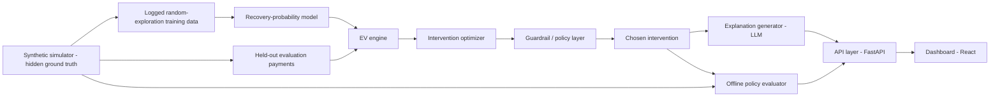

# Recovery Value Engine

A decision engine for already-failed payments: given a failed payment, decide whether recovering it is worth pursuing and which intervention out of a fixed menu maximizes **expected net value** — not just retry-everyone or message-everyone-the-same-way.

Built for the **Razorpay AI Buildathon**, Track 3: AI Revenue Recovery (applications close September 5, 2026).

---

## Where we used AI, and where we deliberately didn't

- The **recovery-probability model, EV math, optimizer, and guardrails are classical and deterministic** — a `scikit-learn` classifier plus plain Python, not an LLM call anywhere in that path. A decision that shapes which customers get contacted, how often, and through which channel needs to be reproducible, debuggable, and auditable. If a customer complains about being contacted five times, we need to trace the exact EV computation and guardrail check that caused it — not shrug at a black box.
- The **only** LLM call in the system is the explanation step: converting an already-made structured decision into a short, ops-readable rationale. That's a natural-language generation task, which is what LLMs are good at — unlike financial decision logic, which needs to be auditable in a way LLM outputs aren't. The explanation is checked against a dark-pattern keyword scan before it's returned, and if `ANTHROPIC_API_KEY` isn't set, it falls back to a deterministic template so the rest of the system still runs without a live key.

Full rationale and trade-off analysis: [docs/ARCHITECTURE.md](docs/ARCHITECTURE.md).

## Why this framing, not the obvious one

Razorpay's own Agent Studio already ships a Dispute Responder, a Subscription Recovery Agent, an Abandoned Cart Conversion Agent, and other agents that follow the shape "detect a failed payment → send a reminder." Building another version of that here would be dead on arrival against a panel that ships those products.

**This project deliberately does not build:**
- A generic failed-payment-to-WhatsApp-reminder bot (already the Subscription/Cart agents)
- A chargeback evidence responder (already the Dispute Responder agent)
- A settlement reconciliation summary tool (already shipped)

What isn't shipped anywhere: a layer that decides, per failed payment, *whether* recovery is worth pursuing and *which* intervention maximizes expected net value, instead of contacting every customer the same way. That's the actual product surface here.

## Architecture



The probability model and optimizer never see the simulator's hidden ground truth — only `evaluator.py` does, and only for offline evaluation. Keeping that boundary clean is what makes the evaluation honest rather than leaked. Full write-up, model-choice trade-offs, and phase-by-phase status: [docs/ARCHITECTURE.md](docs/ARCHITECTURE.md).

## Guardrails

Deterministic, not LLM-decided — enforced by `guardrails.py` before the optimizer ever runs argmax:

- **Contact-frequency cap**: no more than 2 interventions per customer per failed payment.
- **Voice-call threshold**: `voice_call` only eligible when `amount` ≥ ₹5,000.
- **Suppression list**: opted-out customers are never contacted — only `no_action` and `retry_now` (which don't involve contacting the customer) remain eligible.
- **Dark-pattern scan**: generated explanations are checked against a hardcoded phrase list (false urgency, confirm-shaming, fabricated scarcity) before being returned. This is a lightweight safeguard, not a guarantee — a keyword scan can't catch everything a differently-worded dark pattern might say.
- **Audit trail**: every decision logs every intervention's EV — including the ones blocked or rejected, and why — not just the winner. This is what powers the "why not this action?" panel in the dashboard at no extra computation cost.

## Failure recovery

Three deliberate failure scenarios are implemented as real, passing tests (not just described): external API failure during explanation/payment-link generation, an unresolvable payment reference, and exceeded contact/retry limits. The third one caught a real bug — the contact-frequency cap guardrail was correctly unit-tested in isolation but never actually wired to live state, so it could never trigger through the API. Full writeup, including what broke and what changed: [docs/FAILURE_MODES.md](docs/FAILURE_MODES.md).

## Results

Offline / simulator-based, on a held-out batch of 500 synthetic failed payments (seed 42) — **not a live A/B test**; see [docs/EVALUATION.md](docs/EVALUATION.md) for why that distinction matters and how to reproduce these numbers.

| Policy | Net revenue | Net revenue / ₹ spent |
|---|---:|---:|
| Always do nothing | ₹1,95,118.87 | — |
| Always retry now | ₹2,94,779.89 | 294.78x |
| Rule-based heuristic | ₹3,46,877.31 | 455.22x |
| **EV-optimized policy (this project)** | **₹3,83,451.16** | 231.69x |

The EV-optimized policy beats the rule-based heuristic — the credible competitor, not a strawman — on net revenue, which is the metric it's actually optimizing for. It's *less* efficient per rupee spent than the heuristic, because it correctly spends more on higher-cost channels when the model predicts the extra uplift still clears the extra cost. Both numbers are reported; see [docs/EVALUATION.md](docs/EVALUATION.md) for why that's the honest way to read this table.

This isn't a single lucky seed, and the win isn't spread evenly: **it beats the rule-based heuristic on 5/5 independent seeds** (mean net revenue ₹3,90,284 vs ₹3,54,890), and a segment breakdown shows the gain is concentrated exactly where a fixed rule structurally can't adapt — `card_expired` failures (+97%, the heuristic has no special case for them) and payments above ₹5,000 (+98% where `voice_call` becomes eligible, which the heuristic never considers at all) — while it's roughly neutral on failure reasons the heuristic already handles well (`bank_timeout`, `network_error`). Full breakdown and reproduction scripts: [docs/EVALUATION.md](docs/EVALUATION.md).

Recovery-probability model: **AUC 0.680** on held-out `training_logs` (a standard supervised-learning claim, no offline/live caveat attached). Also tested against a logistic-regression baseline — statistically tied (see `docs/EVALUATION.md`), so the model-choice decision in CLAUDE.md Section 19 is resolved with evidence rather than left as a default guess.

## Getting started

**Backend:**

```bash
cd backend
python3 -m venv .venv && source .venv/bin/activate
pip install -r requirements.txt
uvicorn app.main:app --reload
```

The first request triggers a default seeded simulation, model training, and a full decision pass over the batch — expect ~15-20s before it's ready. Copy `backend/.env.example` to `backend/.env` to enable either live integration — both are optional and fall back gracefully without it:
- `ANTHROPIC_API_KEY` for live LLM explanations (falls back to a deterministic template)
- `RAZORPAY_KEY_ID` / `RAZORPAY_KEY_SECRET` (test mode) for a real payment link when `sms_link` is chosen via `POST /decide/{payment_id}` (falls back to omitting the link)

```bash
# run the decision-logic test suite (with the venv above still active)
python -m pytest -q
```

**Frontend:**

```bash
cd frontend
npm install
npm run dev
```

Runs against bundled mock fixtures by default (`VITE_USE_MOCKS=true`), so the dashboard is fully navigable with no backend running. Copy `.env.example` to `.env.local` and set `VITE_USE_MOCKS=false` to point it at the live backend instead.

## Repo structure

```
/backend/app        simulator, probability model, EV engine, optimizer, guardrails, explain, evaluator, FastAPI routes
/backend/tests       pytest coverage for ev_engine, optimizer, guardrails, simulator, failure scenarios
/backend/scripts     reproducible analysis: multi-seed robustness, model comparison, segment breakdown
/frontend/src        React dashboard: decision queue, drill-down + "why not this action?", policy comparison, model metrics
/docs/ARCHITECTURE.md  full architecture decision record
/docs/EVALUATION.md    evaluation methodology and results, kept current
/docs/FAILURE_MODES.md deliberate failure-recovery scenarios: what was tested, what broke, what changed
```

## Explicitly out of scope for v1

- **Pre-failure prediction** — flagging revenue at risk before a payment fails is a different, larger problem.
- **Live message sending** — WhatsApp, email, and voice interventions are logged/simulated, not actually sent. `sms_link` is the exception: when the optimizer chooses it via an explicit `POST /decide/{payment_id}` call, the backend calls Razorpay's real test-mode Payment Links API and returns the actual link (`app/razorpay_client.py`). Requires `RAZORPAY_KEY_ID`/`RAZORPAY_KEY_SECRET` in `backend/.env` (see `backend/.env.example`); without them, the field is simply omitted rather than the request failing. Skipped during the bulk auto-decide pass on `/simulate` (500 real HTTP calls at every startup would make it slow and flaky) — it only fires on an explicit per-payment decide, which is the actual demo path.
- **True live A/B / incremental measurement** — the offline simulator-based evaluation above is a stand-in, clearly labeled as such throughout this README and `docs/EVALUATION.md`.
- **Discount/incentive interventions** — deferred to keep the guardrail surface area manageable for v1.

These are deliberate boundaries, not gaps discovered by a reviewer.
