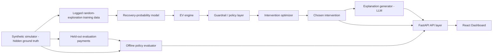

<div align="center">

# Recovery Value Engine
### *Predict. Recover. Optimize. Diagnose. Prove.*

<p align="center">
  <a href="https://recovery-value-engine.vercel.app/" target="_blank">
    
  </a>
  &nbsp;&nbsp;
  <a href="#key-results">
    
  </a>
</p>

<p align="center">
  <a href="https://recovery-value-engine.vercel.app/"><b>Launch Interactive Dashboard</b></a> &nbsp;•&nbsp;
  <a href="#key-results"><b>Key Results</b></a> &nbsp;•&nbsp;
  <a href="#core-decision-problem"><b>Core Decision</b></a> &nbsp;•&nbsp;
  <a href="#architecture"><b>Architecture</b></a> &nbsp;•&nbsp;
  <a href="#guardrails"><b>Guardrails</b></a> &nbsp;•&nbsp;
  <a href="#getting-started"><b>Quickstart</b></a>
</p>

</div>

A decision engine for already-failed payments: given a failed payment, it figures out whether recovery is actually worth the cost and picks the intervention that maximizes **expected net value**, instead of spamming retries or treating every customer identically.

Built for the **Razorpay AI Buildathon, Track 3: AI Revenue Recovery**.

> **Integration boundary:** The demo includes one genuine Razorpay Test Mode payment-link execution. Recovery performance results are generated through an offline simulator and are not live merchant A/B results.

---

## Key Results

| Metric / Experiment | Result |
|---|---:|
| Net recovered revenue (held-out batch of 500) | **₹3,83,199.44** |
| Net gain vs rule-based heuristic | **+₹36,322 (+10.47%)** |
| Independent seeds vs primary heuristic | **20/20 wins** |
| Adversarial heuristic stress test | **19/20 wins** |
| Human review escalation rate | **8.5% (p95 capacity threshold)** |
| Recovery probability model AUC | **0.680** |

---


## Why this framing, not the obvious one

Razorpay's own Agent Studio already ships a Dispute Responder, a Subscription Recovery Agent, an Abandoned Cart Conversion Agent, and other agents that follow the shape "detect a failed payment, then send a reminder." Building another version of that here would replicate existing products.

**This project deliberately does not build:**
- A generic failed-payment-to-WhatsApp reminder bot (already covered by Subscription and Cart agents)
- A chargeback evidence responder (already handled by Dispute Responder)
- A settlement reconciliation summary tool (already shipped)

What is missing in existing tooling: a decision layer that calculates, per failed transaction, *whether* recovery makes financial sense and *which* intervention maximizes expected net recovery, rather than treating every customer the same way. That decision problem is what we set out to solve.

---

## Core Decision Problem

Given a payment that has already failed, decide whether recovering it is worth the cost and which intervention maximizes expected net value, subject to strict deterministic guardrails.

### Expected Net Value Formula

```text
EV(action) = P(recovery | context, action) × payment_amount − intervention_cost
```

RVE computes this expected net value for every candidate intervention before selecting the highest-value eligible action.

### Seven Bounded Interventions

RVE evaluates seven bounded interventions:

1. `retry_now` (₹2 unit cost, immediate background retry)
2. `retry_later` (₹1 unit cost, delayed retry for timing-sensitive issues)
3. `send_sms` (₹3 unit cost, SMS with Razorpay payment link)
4. `send_email` (₹1 unit cost, low-cost email nudge)
5. `send_whatsapp` (₹5 unit cost, high-engagement message)
6. `offer_incentive` (₹10 unit cost, fee discount or waiver)
7. `voice_call` (₹15 unit cost, high-touch outbound call for high-value payments)

The optimizer selects only from interventions that survive the deterministic guardrail layer. If no action yields positive expected value or if safety policies require suppression, RVE chooses `no_action` (cost ₹0).

### Canonical Decision Example

For payment `pay_2ff975708893` (₹3,013.68, `insufficient_funds`):

1. RVE predicts recovery probability for each candidate intervention.
2. Expected net value is calculated for all seven candidates.
3. `voice_call` produces the highest raw EV: **₹719.81**.
4. The voice call is rejected because the payment amount is below the **₹5,000 voice threshold**.
5. RVE selects **`retry_later`** from the remaining eligible actions.
6. The complete decision, all candidate EVs, and rejection reasons are committed to the audit trail.

The engine does not simply choose the largest number. It chooses the **largest allowed economic value**.

---

## Where we used AI, and where we deliberately didn't

- **The recovery-probability model, EV math, optimizer, and guardrails are classical and deterministic.** They run on a `scikit-learn` classifier and plain Python, with zero LLM calls in the decision path. Any decision that impacts who gets contacted, how often, and through which channel needs to be reproducible, debuggable, and auditable. If an operator asks why a customer was contacted through voice instead of email, we can point to the exact expected-value breakdown and guardrail checks rather than shrugging at an opaque prompt.
- **Uncertainty reduces autonomy as real behavior, not just a design slogan.** Alongside the primary model, we run a 20-member bootstrap ensemble (classical `scikit-learn`, no LLMs). The ensemble's *disagreement* on a prediction, rather than its distance from 50%, serves as our uncertainty signal. When disagreement on the top-ranked action reaches or exceeds the 95th percentile of our held-out distribution, the decision routes to `escalate`. This is a first-class terminal outcome logged in the audit trail with the reason "confidence below threshold." The underlying point estimate that drives EV math remains untouched; the ensemble simply checks whether independent models agree. **We set the escalation cutoff (p95) around operational capacity rather than an abrupt cliff in reliability.** A calibration-correlation check (Spearman rho=0.48, p≈0, n=6,000 held-out examples with verified zero leakage across all 20 bootstrap resamples) confirms that disagreement reliably tracks error, and our display tiers (p33/p67) clearly partition reliability (Brier 0.128 → 0.189 → 0.221). However, the escalated band's reliability (Brier 0.215, n=300) is statistically very close to the p67 to p95 band that runs autonomously (Brier 0.221, n=1,680) because the signal saturates around p67. We picked p95 to keep escalation volume manageable for human review (~8.5% of a batch), not because confidence suddenly collapses at that exact number. The p33 to p95 band is flagged as **Low confidence** in the dashboard and allowed to run autonomously by deliberate trade-off, balancing throughput against residual risk. Full numbers are documented in [docs/EVALUATION.md](docs/EVALUATION.md).
- **The only LLM call in the entire system is the explanation step.** Its job is purely translation: turning an already-computed, structured decision into a clear, operator-readable summary. That is a natural language generation task where LLMs excel, unlike financial optimization which requires deterministic guarantees. Generated explanations pass through an automated dark-pattern keyword scan before reaching the user. If `ANTHROPIC_API_KEY` is omitted, the engine falls back to a deterministic template so local development works seamlessly. Escalated decisions skip the LLM call entirely and use a standard template, ensuring the engine remains fast and predictable.

Full rationale and trade-off analysis: [docs/ARCHITECTURE.md](docs/ARCHITECTURE.md).

---

## Architecture




## Evaluation Integrity

A strict structural boundary separates live decisioning from offline evaluation.

The hidden ground truth (`_simulator_truth`) is never accessible to the probability model, EV engine, optimizer, or live decision routes.

Only offline evaluation and diagnostic modules can access it:
- `evaluator.py` (offline policy benchmark)
- `recovery_lab.py` (merchant digital twin simulation)
- `revenue_autopsy.py` (post-hoc leakage diagnostics)

This prevents ground-truth leakage into live decisioning and ensures that reported recovery results are independently evaluated rather than self-reported. Full write-up, model-choice trade-offs, and phase-by-phase status: [docs/ARCHITECTURE.md](docs/ARCHITECTURE.md).

---

## Guardrails

All guardrails are deterministic and enforced by `guardrails.py` before the optimizer ever runs:

- **Fraud-block recovery suppression** (hard risk policy): Any payment flagged with `fraud_block` is strictly prohibited from receiving recovery actions (no retries, nudges, incentives, or automated gateway calls). This is a hard safety rule that overrides optimization. It runs during candidate filtering via `guardrails.recovery_suppression_policy`, collapsing the eligible action set to `[no_action]` before the EV optimizer even scores alternatives. The live decision route, Recovery Lab, offline evaluator, and Negotiation Engine all share this exact canonical rule, logging `risk_policy: "fraud_block_recovery_suppression"` directly to the audit trail.
- **Contact-frequency cap**: No more than 2 interventions per customer per failed payment.
- **Voice-call threshold**: Voice outreach is only eligible when the transaction `amount` is at least ₹5,000.
- **Suppression list**: Opted-out customers are never contacted. In these cases, only `no_action` and silent background retries (`retry_now`) remain eligible.
- **Dark-pattern scan**: All generated explanations are screened against a phrase list targeting false urgency, confirm-shaming, and artificial scarcity. This serves as a lightweight automated safeguard, acknowledged candidly as a safety filter rather than an absolute guarantee.
- **Confidence gate**: After picking the top-ranked action, if the bootstrap ensemble's disagreement exceeds the 95th percentile threshold, the engine routes the payment to human review (`escalate`). This check happens before committing any action, so escalated decisions trigger no outreach and make no live API calls.
- **Audit trail**: Every decision captures the expected value and model agreement for all candidates (including rejected alternatives and specific guardrail blocks), not just the winning intervention. This powers the interactive "why not this action?" inspection panel in the dashboard with zero added latency.

---

## Features

RVE provides six cohesive product surfaces across the recovery lifecycle:

1. **Payment Success Score (PSS):** Advisory pre-failure telemetry that estimates transaction success odds by payment method prior to checkout.
2. **Recovery Opportunities Queue:** Real-time stream of failed payments scored by expected net recovery value with one-click decision inspectability.
3. **Decision Drill-Down & "Why Not This Action?":** Full audit log transparency comparing all seven candidate actions against deterministic guardrails.
4. **Recovery Negotiation Engine:** Autonomous agent that generates counterfactual recovery concessions (split-pay, method switch, fee waiver) based on failure root causes.
5. **Recovery Lab:** Merchant digital twin simulating recovery policies under budget, capacity, and channel constraints.
6. **Revenue Autopsy:** Post-mortem diagnostic tool pinpointing where revenue leaked across failure categories.

---

## Failure recovery

We built and tested three deliberate failure scenarios as part of the core test suite: external API outages during explanation or payment-link creation, unresolvable payment references, and exceeded contact/retry caps. Testing these scenarios caught a real bug early: the contact-frequency guardrail had passed unit tests in isolation, but had not been wired to persistent state in the API handler. Details on what failed and how it was resolved are in [docs/FAILURE_MODES.md](docs/FAILURE_MODES.md).

---

## Results

Evaluated offline on a held-out synthetic test batch of 500 failed payments (`seed=42`). Note that this is a simulator benchmark rather than a live production A/B experiment; see [docs/EVALUATION.md](docs/EVALUATION.md) for the exact replication steps and methodological notes.

| Policy | Net revenue | Net revenue / ₹ spent |
|---|---:|---:|
| Always do nothing | ₹1,95,118.87 | N/A |
| Always retry now | ₹2,94,779.89 | 294.78x |
| Rule-based heuristic | ₹3,46,877.31 | 455.22x |
| **EV-optimized policy (this project)** | **₹3,83,199.44** | 237.72x |

The EV-optimized policy outperforms the rule-based heuristic (our primary, realistic benchmark) on total net recovered revenue. While the rule-based heuristic achieves a higher ratio per rupee spent by sticking to dirt-cheap channels, the EV engine deliberately spends more on high-touch channels when the predicted recovery value easily justifies the fee. Reporting both metrics gives a clear and transparent view of economic performance. Full details and baseline definitions are in [docs/EVALUATION.md](docs/EVALUATION.md).

This advantage is consistent across runs: **the EV policy beats the heuristic on 20 out of 20 independent seeds. The tougher adversarial benchmark provides an additional stress test: RVE wins 19 out of 20 runs, with the single loss on seed 42 reported openly.**

A breakdown by segment shows the gains are concentrated where static rules fall short: `card_expired` failures (+97% improvement, where the heuristic lacks specific logic) and higher-ticket transactions above ₹5,000 (+98%, where voice calls become viable). For transient glitches like `bank_timeout` or `network_error`, both policies perform similarly since basic retries already do well. Reproduction scripts and data slices are in [docs/EVALUATION.md](docs/EVALUATION.md).

To stress-test these findings, we ran an adversarial benchmark across **20 independent random seeds against a second, harder rule-based competitor built specifically to try to beat RVE** (amount-aware, uses `voice_call`, treats `fraud_block` as not worth contacting). RVE beat the original heuristic on 20/20 seeds and the harder one on 19/20. Full adversarial methodology, both baselines, a 14-question economic red-team pass, and a live Razorpay test-mode failure demonstration.

The recovery-probability model scores an **AUC of 0.680** on held-out training logs. We evaluated both HistGradientBoosting and Logistic Regression; because they performed essentially neck-and-neck, the model selection was documented with benchmark evidence rather than an arbitrary preference. See [docs/EVALUATION.md](docs/EVALUATION.md).

---

## Tech Stack

| Layer | Technology |
|---|---|
| Backend API | FastAPI, Python 3.11+ |
| ML & Inference | scikit-learn (HistGradientBoostingClassifier, 20-model bootstrap ensemble) |
| Frontend | React 19, Vite, Tailwind CSS v4, Framer Motion |
| Simulation | Deterministic synthetic payment simulator (`seed=42`) |
| Evaluation | Python offline policy evaluation framework |
| Language Model | Anthropic Claude API (operator explanations only) |
| Payment Gateway | Razorpay Test Mode API (Payment Links) |
| Testing | pytest |

---

## Getting started

**Live Web Application:**  
Experience the interactive system live without local setup at **[https://recovery-value-engine.vercel.app/](https://recovery-value-engine.vercel.app/)**.

**Backend:**

```bash
cd backend
python3 -m venv .venv && source .venv/bin/activate
pip install -r requirements.txt
uvicorn app.main:app --reload
```

Startup initializes a deterministic simulation (`seed=42`), fits the probability model and its 20-member confidence ensemble, and scores the default batch. This initial run takes about 3 to 3.5 minutes on a laptop due to ensemble fitting. You can poll `GET /health` for readiness: it responds with `{"ready": false, "status": "initializing"}` during startup and flips to `{"ready": true, ...}` with the demo's `canonical_payment_id` once finished. To reset back to this clean baseline at any time, call `POST /demo/reset`.

Copy `backend/.env.example` to `backend/.env` if you want to test live API integrations (both are completely optional and fall back gracefully):
- `ANTHROPIC_API_KEY` for live LLM explanations (falls back to a deterministic template)
- `RAZORPAY_KEY_ID` / `RAZORPAY_KEY_SECRET` (test mode) for a real payment link when `sms_link` is chosen via `POST /decide/{payment_id}` (falls back to omitting the link)

```bash
# run the decision-logic test suite (with the venv above still active)
python -m pytest -q
```

**Frontend:**

```bash
cd frontend
npm install
npm run dev
```

The frontend runs against bundled mock data by default (`VITE_USE_MOCKS=true`), making the dashboard instantly navigable without spinning up the backend. To connect to the live Python API, copy `.env.example` to `.env.local`, set `VITE_USE_MOCKS=false`, and restart `npm run dev`. In live mode, the UI polls `GET /health` and transitions into the app automatically as soon as the backend completes initialization.

**Guided demo:** The Recovery Opportunities page includes a **Guided demo** banner linking to a canonical payment (`pay_2ff975708893`, ₹3,013.68 with `insufficient_funds`). In this case, `voice_call` delivers the highest raw expected value but gets blocked by the ₹5,000 threshold guardrail, so `retry_later` wins instead. The demo also links directly to a fraud-block suppression example, showing policy enforcement in action.

---

## Repo structure

```
/backend/app        simulator, probability model, EV engine, optimizer, guardrails, explain, evaluator, FastAPI routes
/backend/tests       pytest coverage for ev_engine, optimizer, guardrails, simulator, failure scenarios
/backend/scripts     reproducible analysis: multi-seed robustness, model comparison, segment breakdown
/frontend/src        React dashboard: decision queue, drill-down + "why not this action?", policy comparison, model metrics
/docs/ARCHITECTURE.md  full architecture decision record
/docs/EVALUATION.md    evaluation methodology and results, kept current
/docs/FAILURE_MODES.md deliberate failure-recovery scenarios: what was tested, what broke, what changed

```

---

## Explicitly out of scope for v1

- **Pre-failure payment routing:** Payment Success Score is included as an advisory, read-only layer. It does not make live routing decisions and uses synthetic telemetry. Production-grade pre-failure routing remains future work.
- **Live customer messaging:** WhatsApp, email, and voice channels are simulated and logged for auditability rather than dispatched to real phone numbers. The one real API integration is `sms_link`: when selected during an individual `POST /decide/{payment_id}` walkthrough, the backend creates an authentic Razorpay test-mode payment link via `app/razorpay_client.py`. Requires credentials in `backend/.env`.
- **Live incremental A/B experimentation:** All reported uplift figures come from our offline simulator benchmark rather than live user traffic, as detailed throughout this document and `docs/EVALUATION.md`.
- **Discount and fee incentives:** Dynamic discounting was left out of v1 to keep guardrail surface area clean and predictable.

These are deliberate boundaries chosen to keep the engine rigorous and defensible.

---

## Future Work

The current implementation intentionally separates decisioning, safety, execution, and offline evaluation. The next stage moves RVE toward production revenue recovery while preserving these boundaries:

1. Live Payment & Gateway Intelligence
2. Causal Recovery & Uplift Modeling
3. Production-Grade Recovery Channels
4. Persistent Audit & Observability
5. Production Incentive Execution
6. Online Evaluation & Experimentation
7. Adaptive Learning
8. Advanced Human-in-the-Loop Controls
9. Multi-Merchant & Enterprise Scaling
10. Privacy, Security & Compliance

**Long-term vision:** RVE can evolve from an offline economic decision engine into a closed-loop revenue intelligence system: preventing failures where possible, recovering economically worthwhile payments when they occur, learning from real outcomes, and continuously identifying high-leverage changes merchants can make to reduce revenue leakage. The core principle stays unchanged: maximize economically worthwhile recovery, not recovery at any cost.

---

## License

This project is licensed under the MIT License. See [LICENSE](LICENSE).
