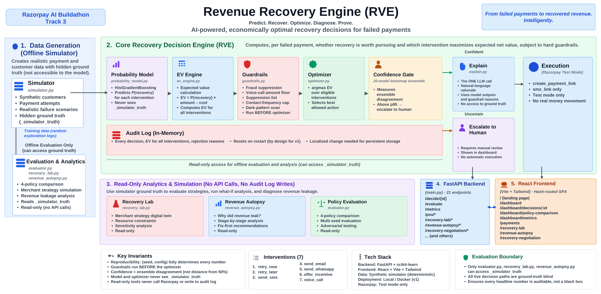
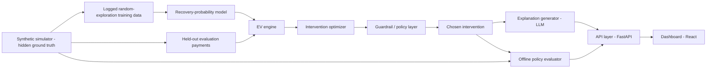

# ADR-001: Recovery Value Engine Architecture

**Status:** Accepted
**Date:** 2026-08-23
**Deciders:** Project owner (solo build, Razorpay AI Buildathon submission)

## Context

The track brief asks for an agent that detects revenue at risk, decides the right intervention, and executes a bounded recovery workflow, with a measured recovery number, compliant escalation, stopping rules, and an audit trail. Razorpay's own Agent Studio already ships a Dispute Responder, a Subscription Recovery Agent, an Abandoned Cart Conversion Agent, a COD/RTO risk detector, and a settlement-summary agent — all of which follow the shape "detect failure → contact customer the same way." Submitting a variant of that is dead on arrival against a panel that ships those products.

The gap: nothing publicly shipped decides, per failed payment, *whether* recovery is worth pursuing and *which* intervention maximizes expected net value, as opposed to contacting everyone identically. That gap is the actual product surface for this build.

This creates two hard requirements that shape every downstream choice:

1. The decision logic moves money (indirectly, via which customers get contacted and how). It must be reproducible, debuggable, and auditable — "why was this customer contacted 5 times" needs a traceable answer, not a black-box shrug.
2. The evaluation of "did this help" must be honest. Because there is no live production traffic, any claimed recovery number is necessarily a simulator-based estimate, not a live A/B result, and the architecture has to make that boundary structurally obvious rather than something a reviewer has to take on faith.

## Decision

Build a linear pipeline with one deliberate boundary: the probability model and the optimizer never see the simulator's hidden ground truth; only a separate evaluation harness does.

**Pipeline, in order:**

1. **Simulator** generates `customers`, hidden `_simulator_truth` (base recovery probability + per-intervention uplift by failure reason/amount band), and `failed_payments`. Seeded for reproducibility.
2. **Random-exploration training logs**: interventions assigned uniformly at random (not by any policy), outcomes sampled from the hidden truth with noise. This is what makes the training data causally clean — a policy-assigned dataset would let the model learn "who we already chose to contact" instead of "what contacting them does."
3. **Recovery-probability model** (`scikit-learn`) trains on `training_logs` only, treating `assigned_intervention` as a feature, so it learns P(recovery | context, intervention) for every intervention, not just the one that was tried.
4. **EV engine** computes `EV = P(recovery) × amount − unit_cost` per intervention per payment, using only the trained model's outputs — never the hidden truth.
5. **Optimizer** takes the argmax EV.
6. **Guardrail layer** filters the menu *before* argmax (hard `fraud_block` recovery-suppression policy, contact-frequency cap, voice-call amount threshold, suppression list) — guardrails constrain the choice set, they don't get consulted after the fact. The `fraud_block` policy is a risk/trust-&-safety rule that outranks the model and the EV math: for a fraud-flagged failure the eligible set is `[no_action]` and nothing else, enforced by one canonical function (`guardrails.recovery_suppression_policy`) that the live decision path, the Recovery Lab, the offline evaluator, the Negotiation Engine, and the execution boundary all consume.
7. **Explanation generator** is the only LLM call in the system: structured decision + EV components in, short operator-readable rationale out, checked against a dark-pattern keyword scan.
8. **Audit log** captures every EV considered (not just the winner) and which were blocked by which guardrail — this both satisfies the "audit trail" bar and powers the "why not this action?" dashboard panel at zero extra computation cost.
9. **Offline policy evaluator** is the only module with read access to `_simulator_truth`. It computes exact expected net revenue for four policies (do-nothing, always-retry, rule-based heuristic, EV-optimized) on a held-out batch. Because truth is fully known in a synthetic simulator, this is closed-form arithmetic, not Monte Carlo or inverse-propensity estimation — a real deployment would need one of those instead, and the README states that explicitly.

## Options Considered

### Model choice for recovery-probability: gradient boosting vs. logistic regression

| Dimension | HistGradientBoostingClassifier | Logistic regression (one-hot) |
|---|---|---|
| Native categorical handling | Yes | No — needs encoding |
| Calibration under time pressure | Harder to reason about, needs isotonic/Platt scaling to check | Easier, coefficients are directly inspectable |
| Explainability to a panel | Feature importances, still inspectable | Most explainable option available |
| Expected accuracy on this data | Likely better given nonlinear failure-reason × intervention interactions | Likely fine given moderate feature count |

**Decision:** default to `HistGradientBoostingClassifier`; fall back to logistic regression if calibration proves hard to reason about under deadline pressure. Both are `scikit-learn`, so the fallback is a low-cost swap, not a rearchitecture.

### Where the LLM sits in the pipeline

| Option | Assessment |
|---|---|
| LLM chooses the intervention | Rejected — a financial decision needs to be reproducible and traceable to a specific number, not a token sequence. Fails the "AI judgment" bar this track explicitly grades. |
| LLM computes or adjusts EV | Rejected — same reason; EV math must be auditable arithmetic. |
| LLM only explains an already-made deterministic decision | **Accepted** — natural-language generation is what LLMs are actually good at, and it's the one place in this pipeline where auditability isn't the primary requirement. |

### Evaluation methodology

| Option | Assessment |
|---|---|
| Claim live A/B / incremental recovery numbers | Rejected — no live traffic exists; would be a credibility risk with a panel that ships real recovery agents and will ask how the number was measured. |
| Monte Carlo simulation of outcomes | Unnecessary — ground truth is fully known analytically in a synthetic simulator, so exact expected value is computable directly. |
| Exact expected-value comparison against hidden ground truth, explicitly labeled offline/simulator-based | **Accepted** — most honest option available given the constraints, and naming the limitation is itself a stronger signal than hiding it. |

## Trade-off Analysis

The central trade-off is **honesty vs. impressiveness of the headline number**. A live-sounding "we recovered ₹X" claim would read better in a 5-minute pitch than "in a labeled offline simulation, the EV-optimized policy recovers more net expected revenue than a rule-based heuristic." But the track is judged partly on "AI judgment" and "failure recovery" (what broke, what we did about it) — a panel that ships production recovery agents will ask how any number was measured, and an overclaimed live result is a bigger risk to the pitch than a clearly-labeled offline one.

The second trade-off is **model complexity vs. time-to-calibrated**. Gradient boosting is likely more accurate but harder to calibrate quickly; logistic regression is easier to trust under deadline pressure. Keeping both in the same `scikit-learn` surface means this can be decided empirically (Aug 26-27, Phase 3) rather than committed to now.

## Consequences

- **Easier:** every decision is traceable to a specific EV computation and a specific guardrail check — debugging "why was X contacted" is a log lookup, not a model interrogation. The audit log data structure (all EVs + rejected reasons) means the "why not this action?" dashboard panel requires no new computation, only a new view.
- **Harder:** the model/optimizer are structurally forbidden from seeing `_simulator_truth`, which means any temptation to "check the real answer" while debugging the model has to go through the evaluator module instead — a deliberate friction, not an oversight.
- **Must revisit:** if the gradient-boosting model's calibration curve is poor on the held-out slice (Phase 3, Aug 26-27), the fallback to logistic regression needs to happen before Phase 4 starts, not after the optimizer is already built against a bad model.
- **Explicitly not handled by this architecture:** pre-failure prediction, live message sending (only the Razorpay test-mode payment-link intervention hits a real API), true live A/B measurement. These are out of scope for v1 by deliberate design, not gaps discovered later.

## Action Items

1. [ ] Simulator (`simulator.py`): `customers`, hidden `_simulator_truth`, `training_logs` with random-exploration assignment — Phase 2 (Aug 24-25)
2. [ ] Baselines: do-nothing, always-retry, rule-based heuristic policies — Phase 2 (Aug 24-25)
3. [ ] `probability_model.py`: train + report AUC/calibration on held-out `training_logs` slice — Phase 3 (Aug 26-27)
4. [ ] `ev_engine.py`, `optimizer.py`, `guardrails.py`: end-to-end single-payment decision with guardrail-filtered argmax and rejected-alternative logging — Phase 4 (Aug 28-29)
5. [x] Razorpay test-mode payment-link wiring — Phase 5 (Aug 30), done early. Fires on an explicit `POST /decide/{payment_id}` when `sms_link` is chosen, not during the bulk `/simulate` auto-decide pass (would be ~500 real HTTP calls per startup). Falls back to omitting the link (with a reported reason) if `RAZORPAY_KEY_ID`/`RAZORPAY_KEY_SECRET` aren't set.
6. [ ] `explain.py` + dashboard (decision queue, drill-down, policy-comparison) — Phase 6 (Aug 31-Sep 1)
7. [x] `evaluator.py`: four-policy comparison table, committed as a result artifact, plus documented failure-scenario tests (API timeout, ambiguous payment status, exceeded retry limit) — Phase 7 (Sep 2-3), done early. See [docs/FAILURE_MODES.md](FAILURE_MODES.md) — the retry-limit test caught and fixed a real bug (contact-frequency cap never wired to live state).
8. [ ] README, docs, clean commit history, rehearsed pitch — Phase 8 (Sep 4-5)
