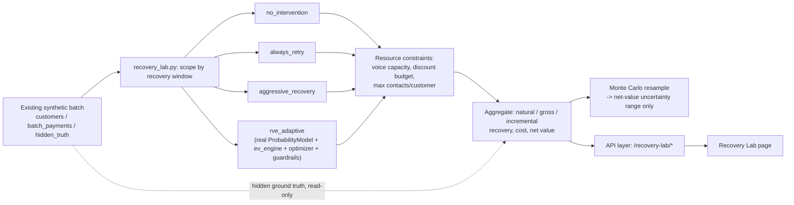

# Recovery Lab — Revenue Recovery Digital Twin

**This is an offline/synthetic simulation and is not a production forecast.** Read that sentence twice before quoting any number below in a pitch — see [Honesty boundary](#11-honesty-boundary).

## 1. Problem

The rest of this repo (the Recovery Value Engine, "RVE") decides one already-failed payment at a time: given a payment's context, pick the intervention that maximizes expected net value, subject to guardrails. That's the right unit of analysis for *executing* a recovery decision, but it's the wrong unit for a merchant asking a *strategy* question: "if I turn on RVE Adaptive with these resource limits, what happens across my whole failed-payment book — and is that actually better than what I'd get from just retrying everyone, or being aggressive with WhatsApp and voice calls?"

Recovery Lab answers that second question. It sits above RVE, not beside it: it simulates what would happen if a chosen policy — including RVE Adaptive itself — were applied to the merchant's synthetic failed-payment population under configurable resource constraints, and reports the answer *before* anything is deployed.

## 2. Why the existing RVE pipeline is insufficient for this

RVE's `/decide/{payment_id}` endpoint answers "what should happen to this one payment," using the trained probability model, `ev_engine.py`, `optimizer.py`, and `guardrails.py`. It has no notion of:

- a resource *budget* shared across many payments (voice capacity, a discount/spend cap) — RVE's guardrails are per-payment eligibility rules, not population-level scarcity;
- comparing what a merchant-chosen policy (e.g. "be aggressive") would do differently from RVE, across the whole book, at once;
- finding an economically efficient *operating point* — e.g. "where does more voice capacity stop paying for itself?" — which requires re-running a policy at many capacity levels and comparing the results, not a single decision.

None of that is a gap in RVE's per-payment logic; it's a different question, at a different level, that RVE was never designed to answer. Recovery Lab is the layer that answers it, by orchestrating the *existing* RVE components rather than rebuilding them.

## 3. Architecture

Recovery Lab (`backend/app/recovery_lab.py`) reuses, rather than reimplements:

| Reused from | For |
|---|---|
| `app.simulator` (via `main.py`'s existing `state`) | The synthetic `customers` / `batch_payments` / hidden `_simulator_truth` — the *same* batch the RVE dashboard already shows, not a second population |
| `app.probability_model.ProbabilityModel` | RVE Adaptive's per-payment P(recovery \| context, intervention) — the same trained model, via a new `predict_proba_batch_matrix` method added for vectorized bulk inference (not a new model) |
| `app.guardrails.apply_guardrails` | Suppression list, voice-call amount threshold, and the contact-frequency cap (now accepting a caller-supplied cap, defaulting to RVE's fixed value, so every existing caller is unaffected) |
| `app.ev_engine.compute_ev_for_menu`, `app.optimizer.select_best_intervention` | RVE Adaptive's argmax-EV selection, unchanged |

Like `evaluator.py`, `recovery_lab.py` is one of the few modules allowed to read the hidden `_simulator_truth` table — "what would have happened under a policy we didn't actually run" is an offline-evaluation question, the same architectural exception `evaluator.py` already has, not a new precedent.

**Nothing here calls Razorpay, sends a real message, or writes to the RVE audit log.** It is a pure read of existing state plus arithmetic on top of it — confirmed by a test that runs both `/recovery-lab/simulate` and `/recovery-lab/sensitivity` and asserts `GET /decisions`'s count is unchanged (`test_recovery_lab_never_appends_to_audit_log`).

## 4. Policy definitions

| Policy | Logic |
|---|---|
| **No intervention** | Every payment gets `no_action`. The floor baseline. |
| **Always retry** | Every payment gets `retry_now` (never blocked by any guardrail — it's in the guardrails' `NON_CONTACT_INTERVENTIONS` set). |
| **Aggressive recovery** | Picks the highest-**cost** channel that is both permitted by the selected contact intensity (see below) and guardrail-eligible — deliberately *not* EV-optimal, which is the point: it exists to be contrasted with RVE Adaptive on net value, not to win. |
| **RVE Adaptive** | Genuinely runs the RVE pipeline: the trained `ProbabilityModel`, `compute_ev_for_menu`, `apply_guardrails`, and `select_best_intervention`, for every payment in scope. |

**Contact intensity** (low / moderate / high) only changes which channels Aggressive Recovery is allowed to reach for:

| Intensity | Channels in play |
|---|---|
| Low | email, retry_later, retry_now |
| Moderate | + sms_link, whatsapp_nudge |
| High | + voice_call |

## 5. Resource constraints

All four policies compete for the **same** constrained resources in a given simulation, so the comparison is apples-to-apples:

- **Voice capacity** — a cap on how many `voice_call` interventions can be used across the whole batch. When demand exceeds capacity, the highest-EV (RVE Adaptive) or highest-amount (other policies) payments keep the slot; the rest are demoted to their next-best eligible alternative.
- **Discount/spend budget** — a total ₹ cap on intervention cost across the batch. Payments are funded in priority order (EV, or amount as a proxy) until the budget runs out; anything past that point is demoted straight to `no_action` (a documented simplification — a real system might cascade to the next-cheapest channel instead).
- **Max contacts per customer** — the contact-frequency cap (1–3), now merchant-configurable rather than RVE's fixed value of 2, tracked cumulatively across a customer's payments within one simulation pass.
- **Recovery window** (24h / 48h / 72h / 7 days) — filters which failed payments are even in scope, by `failed_at` age. This is a real dataset filter, not cosmetic: a tighter window genuinely shrinks the simulated population.

## 6. Metrics and economic definitions

- **Natural recovery** — expected revenue recovered with `no_action`, using the hidden ground truth's own no-action outcome (`base_recovery_prob + uplift_by_intervention["no_action"]`, not raw `base_recovery_prob` — the simulator's uplift table applies a small noise term to every intervention id, "no_action" included, so using the raw base probability would make even the *no_intervention* policy show a nonzero "incremental recovery," which would be wrong by definition).
- **Gross recovery** — expected revenue recovered under the simulated policy's actual chosen interventions.
- **Incremental recovery** — `gross_recovery − natural_recovery`.
- **Intervention cost** — sum of unit costs actually paid (post resource-constraint demotion).
- **Net value created** — `incremental_recovery − intervention_cost`. **Not** `gross_recovery − cost` — the whole point of this project is that the comparison that matters is against the do-nothing baseline, not gross spend accounting.
- **Recovery rate / incremental recovery rate** — the above divided by total revenue at risk in scope.
- **Number blocked (by guardrail / by capacity)** — tracked separately: "guardrail" covers suppression, the voice-amount threshold, and the contact cap; "capacity" covers voice-capacity and budget exhaustion. Both feed the aggregate `number_blocked`.
- **Number escalated** — RVE Adaptive payments the confidence gate handed to a human instead of acting on (see the "Confidence gate" subsection in Section 12). Accounted as `no_action`; carried as an `"escalate"` key in `allocation` / `allocation_spend`. Always 0 for the other three policies.
- **Average cost per recovery** — intervention cost divided by the *expected number of recoveries attributable to intervened payments* (a sum of probabilities, since this is an expectation-based simulation, not a count of literally-realized outcomes).

All headline metrics are computed **analytically** (exact expectation given the known synthetic ground truth), the same approach `evaluator.py` already uses for RVE's four-policy comparison — see Section 9 on why this is only possible because the ground truth is synthetic.

## 7. Simulation methodology

For a given policy and configuration:

1. Scope the batch to the recovery window.
2. For every in-scope payment (processed in descending-amount order, so scarce resources go to the highest-value payments first), compute the policy's guardrail-eligible choice and the *raw ideal* choice ignoring guardrails — the difference identifies guardrail-blocked payments.
3. Apply the voice-capacity constraint, then the budget constraint, each by priority ranking, demoting anything that doesn't fit.
4. Compute natural/gross/incremental revenue, cost, and net value analytically from the hidden ground truth, plus a per-intervention `allocation` / `allocation_spend` breakdown (a straight count of the final assignment — `allocation` sums to `n_payments_in_scope`, `allocation_spend` sums to `intervention_cost`).
5. Optionally (if `n_simulation_runs > 0`), run a seeded, vectorized, memory-chunked Monte Carlo resample of actual binary recovery outcomes — used **only** to report a sampling-variance range around net value, never as the headline number itself.
6. Repeat for all four policies under the *same* configuration, so nothing is compared against a differently-scoped run.

`POST /recovery-lab/sensitivity` re-runs step 1–4 (Monte Carlo skipped, for speed) across a swept range of one resource dimension, and reports whichever level produced the highest net value as the "optimal operating point" — computed from the actual simulated results at each level, never hardcoded.

## 8. Constraints and safety caps

- A Monte Carlo run count that would produce more than 20,000,000 (payments × runs) cells is silently reduced, and the *actual* count used is reported back in the response (`n_simulation_runs`) rather than the requested one being echoed unchanged — this project's own rule: "do not allow a setting that makes the UI hang indefinitely."
- `n_simulation_runs` is capped at 20,000 by the request model (`Field(..., le=20_000)`).
- The detailed comparison view (policy table, efficiency frontier, sensitivity sweep) runs only on an explicit "Simulate strategy" click, or an explicit resource-sensitivity dimension change reusing the last-simulated configuration.
- The **interactive panel** at the top of the page *does* recompute live as the four sliders (budget, contact cap, voice capacity, recovery window) are dragged — but it is debounced (~70 ms), fires the analytic pass with `n_simulation_runs = 0` (Monte Carlo only on a ~350 ms settle), and cancels superseded requests via `AbortController` + a monotonic sequence guard so a fast drag can never queue a backlog or paint an out-of-order result. It calls the same `POST /recovery-lab/simulate` endpoint — the same read-only, never-calls-Razorpay path — with `policy` fixed to `rve_adaptive`; no slider configuration reaches any execution code.

## 9. Reproducibility

The same `(seed, policy, full configuration)` always reproduces the same result: every headline metric is deterministic arithmetic with no randomness in it at all (decisions are picked by argmax/greedy-priority, not sampled). The only randomness anywhere in this feature is the Monte Carlo layer, which is itself seeded from the request's `seed` (combined with the policy id, so different policies simulated in the same request don't share a draw stream) — confirmed by `test_same_seed_same_config_reproduces_identical_result`.

## 10. Uncertainty

`net_value_low` / `net_value_high` are a **95% simulation range** (2.5th/97.5th percentile across the Monte Carlo runs), explicitly labeled "simulation uncertainty" in the UI — not a statistical confidence interval on a real-world estimate, and not present at all when `n_simulation_runs == 0` (e.g. every point in a sensitivity sweep, which skips Monte Carlo for speed).

## 11. Honesty boundary

- **Offline and synthetic, end to end.** Every number comes from the existing synthetic simulator and the existing trained model — never real transactions, real customers, or live gateway telemetry.
- **Never presented as a live forecast, a production guarantee, or real customer behavior.** The page carries a persistent "Offline simulation" badge and an explicit "no real action is executed" line above the fold, plus an expandable methodology panel restating the same boundary.
- **Never calls Razorpay, sends a real message, or mutates real payment/audit state.** Confirmed by `test_recovery_lab_never_appends_to_audit_log`; `recovery_lab.py` contains no import of `razorpay_client` at all.
- **The "inspect an example decision" link** navigates to the existing, pre-existing RVE decision drill-down page for a representative payment already in the simulated batch — Recovery Lab itself never calls `/decide`; any live behavior on the destination page is that page's own, already-documented behavior (see `docs/INTEGRATION_VERIFICATION.md`), not something this feature triggers.
- **Aggressive Recovery's "aggressive" framing is deliberately not flattering** — it can and often does recover more *gross* revenue than RVE Adaptive while creating *less* net value, and the UI shows this plainly rather than hiding whichever policy the demo would prefer to win (this project's explicit instruction: "never force RVE to win... if a simulation produces a result where another policy wins, show it").

## 12. Example scenario

Default configuration (RVE Adaptive, moderate intensity, ₹50,000 budget, 1,000 voice capacity, cap of 2 contacts, 7-day window) against the default startup batch — these exact figures are pinned by `test_default_config_reproduces_documented_evaluation_numbers`, and are what the interactive panel shows at its default slider positions:

| Policy | Gross recovery | Incremental | Cost | Net value | Contacts | Escalated |
|---|---:|---:|---:|---:|---:|---:|
| No intervention | ₹104,304 | ₹0 | ₹0 | ₹0 | 0 | 0 |
| Always retry | ₹159,655 | ₹55,351 | ₹494 | ₹54,857 | 0 | 0 |
| Aggressive recovery | ₹160,796 | ₹56,491 | ₹1,232 | ₹55,259 | 246 | 0 |
| **RVE Adaptive** | ₹180,675 | **₹76,370** | ₹735 | **₹75,635** | 149 | **21** |

RVE Adaptive creates roughly **38% more net value than Always Retry** while contacting far fewer customers than Aggressive Recovery — the product's central thesis, reproduced from an actual run, not asserted. Of the 247 in-scope payments, **21 are escalated** by RVE Adaptive's confidence gate (below) rather than acted on autonomously; they are accounted as `no_action` here. The escalation threshold is set by human-review capacity, not by a reliability cliff — see the "Confidence gate" subsection below. The other three policies never consult the model and never escalate.

### Confidence gate (RVE Adaptive only)

RVE Adaptive carries a bootstrap-ensemble uncertainty signal alongside the primary probability model (20 `HistGradientBoostingClassifier` members, each fit on a resample of the same `training_logs`; the point estimate the EV math uses is **unchanged** — the ensemble only measures *disagreement*). After the guardrail-filtered argmax picks a top-ranked action, if the ensemble's std dev on that action's P(recovery) is at or above the **95th percentile of the held-out disagreement distribution** (`spread_p95`, ≈ 0.125 on the seed-42 model), the payment is routed to `escalate` instead: a first-class terminal outcome, logged like any other decision, that runs no channel and never calls Razorpay. This is the same gate the live `/decide` path applies; `evaluator.py`'s four-policy benchmark deliberately does **not** apply it (that measures autonomous-policy economics, and "escalate to a human" is not an analytically-scoreable policy — see `docs/EVALUATION.md`).

The escalation threshold (p95 of held-out ensemble disagreement) is set by operational capacity, not by a break in reliability. A calibration-correlation check (Spearman rho=0.48, p≈0, n=6,000 held-out examples; leakage verified — zero held-out rows in any of the 20 bootstrap resamples) confirms disagreement predicts error broadly, and the display tiers (p33/p67) genuinely partition reliability (Brier 0.128 -> 0.189 -> 0.221). The escalated band's reliability (Brier 0.215, n=300) is statistically indistinguishable from the p67-p95 band that continues to run autonomously (Brier 0.221, n=1680; well within the ~0.02 standard error at n=300) -- the signal saturates by p67, partly because higher-spread cases sit nearer P=0.5, where outcomes are more aleatorically noisy, not just harder to model.

We chose p95 to keep escalation volume within plausible human-review capacity (~8.5% of a batch, 21/247 on the default seed), not because p95 uniquely marks where trust collapses. The p33-p95 band is visibly flagged as Low confidence in the UI and continues to run autonomously by design -- surfaced, not hidden, and accepting residual risk in exchange for throughput.

## 13. Limitations

- Resource allocation (voice capacity, budget) is a single greedy priority pass per resource, not a joint optimization across both constraints at once — a globally optimal allocation could occasionally do better.
- Budget-exhausted payments fall straight back to `no_action` rather than cascading to the next-affordable channel.
- **Contact-cap accounting can count a contact that never actually happens.** The per-customer contact-frequency cap is accumulated in the same pass that later gets overridden by the budget phase: if a payment's chosen contact channel is subsequently demoted to `no_action` for lack of budget, the cap "slot" it used was still spent, potentially denying a sibling payment (same customer) a channel for a contact that, in the final output, never occurred. This never lets the cap be *exceeded* — only more conservative than a perfectly joint solver would be.
- **Non-RVE policies ration scarce resources (voice capacity, budget) by raw payment amount, not by expected value — because they have no EV concept of their own** (Always Retry and Aggressive Recovery pick a fixed/rule-based channel per payment regardless of predicted probability). RVE Adaptive rations the *same* scarce resources by true predicted EV. This is a deliberate and arguably realistic asymmetry (a merchant running "Always Retry" wouldn't have an EV model to ration with either) — but it also means part of RVE Adaptive's advantage in the resource-sensitivity/frontier views comes from a smarter *allocation rule*, not solely from smarter *per-payment* decisions. Read the frontier chart as "RVE Adaptive's overall strategy, decision **and** rationing together, beats the alternatives' strategies" — not as an isolated measurement of decision quality alone.
- **Aggressive Recovery is a deliberately unintelligent maximum-touch archetype, not the strongest available non-ML competitor.** It picks the highest-cost eligible channel with zero regard for the failure reason or predicted probability of success. `evaluator.py`'s RVE evaluation (a separate part of this project) already implements a more credible rule-based heuristic (route by failure reason) as the "real claim to beat" baseline; Recovery Lab's Aggressive Recovery is not that heuristic, and comparisons against it should be read as "beats a naive high-touch strategy," not "beats the best non-ML strategy achievable."
- Like the rest of this project, every input distribution (failure-reason mix, uplift tables, base recovery probabilities) is a hand-picked, documented assumption in `simulator.py` — not fitted to real payment-gateway data, because there is none.

## 14. Red-team review (post-launch)

An adversarial review against the 14 questions a skeptical payments engineer would ask (rigged ground truth, cost double-counting, constraint violations, non-reproducibility, UI fabrication, real API calls, etc.) found two genuine bugs, both fixed:

1. **Monte Carlo seeding used Python's built-in `hash()` on the policy id**, which is salted per-process by default — the uncertainty range (`net_value_low`/`net_value_high`) was not actually reproducible across backend restarts for an identical `(seed, config)`, contradicting this document's own reproducibility claim (Section 9). Fixed by switching to `zlib.crc32`, which is stable across processes.
2. **RVE Adaptive's own per-customer contact-slot arbitration was ordered by raw payment amount, not EV** — when a customer had multiple in-scope payments and the contact cap was binding, the slot could go to the lower-value payment simply because it had a higher amount, contradicting "EV-optimized per payment." Fixed by ordering rve_adaptive's row processing by each payment's best achievable menu-wide EV instead.

Every other question in the review passed with direct evidence (constraint enforcement checked against a live batch across a grid of budgets/capacities with zero violations found; reproducibility re-confirmed after the fix; a deliberately under-trained model was used to force RVE Adaptive to actually lose a simulation, and the UI's winner logic correctly showed the alternative policy winning, proving it is not hardcoded). The two items above that were **not** changed (non-RVE amount-based rationing, Aggressive Recovery's naivety) are disclosed above as limitations rather than "fixed," because changing them would mean giving every policy an EV model or adding a new policy archetype — both are feature additions, not bug fixes, and are out of scope for this pass.
