# Recovery Negotiation Engine — Minimum Effective Intervention

**This is an offline/model-based analysis over synthetic data and is not a production forecast or a guarantee of real-world recovery.** Read that sentence twice before quoting any number below in a pitch — see [Honesty boundary](#12-honesty-boundary).

## 1. Problem

RVE (the rest of this repo) answers, per failed payment: *"which intervention should we take?"* — `no_action`, `retry_now`, `sms_link`, and so on, chosen by argmax EV over a fixed menu of discrete, fixed-cost interventions.

That leaves a second, different question unanswered for interventions that can carry a variable incentive attached (a discount, a credit, a fee waiver): *given RVE's chosen intervention, how much incentive is actually worth attaching to it?* A bigger incentive almost always recovers more payments. It does not follow that it creates more value — past some point, the extra recovery it buys is worth less than the extra incentive it costs. Recovery Negotiation Engine answers that question: for RVE's chosen intervention, search a ladder of incentive levels and find the **minimum effective intervention** — the cheapest incentive level that still captures (within a configurable tolerance) the maximum expected net value achievable on that ladder.

## 2. Difference from RVE

| | RVE | Recovery Negotiation Engine |
|---|---|---|
| Question | Which intervention? | How much incentive, on top of that intervention? |
| Search space | 7 fixed, discrete interventions | A configurable ladder of ₹ incentive levels for one intervention |
| Output | One chosen `intervention_id` | A candidate curve + an optimum + a minimum-effective level |
| Position in pipeline | Runs first, on every failed payment | Runs second, only for a payment RVE has already decided on |

Negotiation Engine never replaces RVE's choice of *which* intervention — it takes that choice as given and asks *how much* to spend making it work. It is read-only analysis, never appended to the RVE audit log, and never calls Razorpay (see [Section 11](#11-execution-boundary)).

## 3. Architecture

```mermaid
flowchart LR
    A[Existing batch + audit log<br/>state.batch_payments / state.customers / state.audit_log] --> N[negotiation_engine.py]
    N --> B["1. Look up existing RVE decision<br/>(base_intervention, base P, base EV)"]
    B --> C["2. Generate incentive ladder<br/>(min, max, step -- bounded count)"]
    C --> D["3. Risk/policy eligibility gate<br/>(guardrails.apply_guardrails + incentive-specific checks)<br/>-- BEFORE any economic computation"]
    D --> E["4. For eligible levels only:<br/>P(recovery | c) via base model + documented saturation curve"]
    E --> F["5. EV(c) = P(c)*amount - c - intervention_unit_cost"]
    F --> G["6. Three outcomes:<br/>max P(recovery) / max EV / minimum effective intervention"]
    G --> H["7. Deterministic explanation template<br/>(no LLM)"]
    H --> I[API layer: POST /recovery-negotiation/analyze]
    I --> J[Recovery Negotiation page]
```



Negotiation Engine (`backend/app/negotiation_engine.py`) reuses, rather than reimplements:

| Reused from | For |
|---|---|
| `app.probability_model.ProbabilityModel.predict_proba_for_intervention` | The base (₹0-incentive) recovery probability for RVE's chosen intervention — the real trained model, not a new one |
| `app.guardrails.apply_guardrails` | Base-intervention eligibility (suppression list, voice-call amount threshold, contact-frequency cap) — the exact same gate every other RVE-derived feature uses |
| `app.models.INTERVENTION_UNIT_COSTS` | The fixed execution cost of the base intervention, added into every candidate's EV the same way `ev_engine.compute_ev` does |
| `state.batch_payments` / `state.customers` / `state.audit_log` (via `main.py`'s existing `state`) | The same synthetic payment, customer, and most-recent RVE decision already in memory — no second population, no re-running `/decide` |

Like `recovery_lab.py`, this module contains no import of `razorpay_client` and never calls `state.audit_log.append(...)`.

## 4. Economic formula

For a base intervention chosen by RVE and a candidate incentive level `c` (in ₹, `c >= 0`):

```
P(recovery | c)        = incentive_response(base_probability, failure_reason, c)   -- Section 6
expected_gross_recovery(c) = P(recovery | c) * amount
incentive_cost(c)      = c
intervention_cost       = INTERVENTION_UNIT_COSTS[base_intervention]   -- constant across all c, reused from RVE
expected_net_value(c)  = expected_gross_recovery(c) - incentive_cost(c) - intervention_cost
```

This mirrors `ev_engine.compute_ev`'s `probability * amount - unit_cost` convention exactly, with the incentive added as a second, unconditional cost term (paid regardless of whether the payment ultimately recovers — the same accounting treatment the net-revenue formula in `docs/EVALUATION.md` specifies). `ev_engine.py` itself is not modified; this formula lives only in `negotiation_engine.py` and is documented here so it is never a silently competing definition.

## 5. Incremental recovery

```
incremental_recovery(c) = (P(recovery | c) - P(recovery | 0)) * amount
```

`P(recovery | 0)` — the baseline — is always the RVE base intervention's own recovery probability with **no incentive attached**, computed once from the trained model, never re-derived per candidate. This is what lets the response answer "did this incentive create enough additional recovery to justify itself," not just "how much does this incentive recover in total."

## 6. Incentive-response curve — a documented, explicitly synthetic assumption

The trained `ProbabilityModel` has a fixed, closed vocabulary for `assigned_intervention` (the 7 `InterventionId` values) — it cannot take a continuous incentive amount as a model input without retraining, and this project's design rationale explicitly forbids introducing a second ML model for this. Instead, the incentive effect is a **deterministic, closed-form extension** on top of the real model's baseline prediction, not a new model:

```
P(recovery | c) = clip(
    base_probability + max_uplift[failure_reason] * c / (c + half_saturation[failure_reason]),
    0.0, 1.0
)
```

This is a Hill/saturation curve: uplift grows with `c` but with strictly diminishing returns, approaching (never exceeding) `max_uplift[failure_reason]` as `c -> infinity`. It is deterministic (no randomness), bounded to `[0, 1]` by construction, and reproducible for identical inputs.

**`max_uplift` and `half_saturation` are hand-picked, explicitly synthetic assumptions** — not fitted to real payment or discount-response data, because none exists for this project. They exist to give the engine per-`failure_reason` structure consistent with the domain intuition already documented elsewhere in this repo (different failure reasons imply different things about customer intent), not to assert a real elasticity:

| `failure_reason` | `max_uplift` | `half_saturation` | Synthetic rationale (not a measured fact) |
|---|---:|---:|---|
| `insufficient_funds` | 0.35 | ₹80 | Assumed to be an affordability problem — an incentive is assumed directly relevant |
| `other` | 0.15 | ₹150 | Assumed moderate, uncertain cause |
| `bank_timeout` | 0.05 | ₹300 | Assumed a transient technical issue, not price-sensitive |
| `network_error` | 0.05 | ₹300 | Same assumption as `bank_timeout` |
| `card_expired` | 0.03 | ₹400 | Assumed a channel problem, not a price problem |
| `fraud_block` | 0.00 | n/a | Never modeled as incentive-responsive at all — see Section 8's guardrail |

Because `bank_timeout` and `card_expired` have a low `max_uplift` ceiling, ₹0 legitimately wins for those failure reasons in most scenarios — the curve is not tuned to make a positive incentive look good. See [Section 13](#13-proof-the-model-is-not-rigged) for a worked demonstration that different inputs genuinely produce different winners.

## 7. Candidate ladder generation

Requested as `{min_incentive, max_incentive, step}`. The backend generates `[min_incentive, min_incentive + step, ..., max_incentive]` (inclusive of both ends when evenly divisible). Validated and bounded:

- `min_incentive >= 0`, `max_incentive >= min_incentive`, `step > 0`.
- Candidate count `(max_incentive - min_incentive) / step + 1` is capped at 200; a request implying more is rejected with `400`, not silently truncated — this keeps a malformed request from generating hundreds of thousands of candidates (the same "don't let a setting make the UI hang" discipline as Recovery Lab's Monte Carlo cap, see `docs/RECOVERY_DIGITAL_TWIN.md`).
- `optimization_tolerance` must be in `(0, 1]`.

## 8. Risk/policy eligibility — determined before any economic computation

Per candidate, eligibility is decided **first**, and expected value is computed **only for eligible candidates** — never the reverse. An ineligible incentive level is never assigned an EV, never enters the argmax, and is shown as `BLOCKED` with its reason, exactly mirroring `guardrails.py`'s own stated discipline ("filter the menu before the optimizer's argmax runs, not after").

1. **Base intervention eligibility** — `guardrails.apply_guardrails` re-run for the base intervention (suppression list, voice-call amount threshold, contact-frequency cap). If the base intervention itself is ineligible, every incentive level on it is `BLOCKED` with that same reason — there is nothing to negotiate on top of a blocked intervention.
2. **`fraud_block` guardrail** — for `failure_reason == fraud_block`, only `c = 0` is eligible; every `c > 0` is `BLOCKED` ("Blocked: incentives are never offered on a fraud-flagged payment"). This is a new, deliberate guardrail (not in your original spec, flagged during design) — offering money to recover a payment flagged as fraud is a compliance risk regardless of its economics.
3. **Merchant incentive ceiling** — `c <= max_incentive_policy` (default ₹500, in-memory config, request-overridable — no persistent merchant-policy store exists elsewhere in this codebase, so this is a minimal addition, not a new subsystem). `c` above the ceiling is `BLOCKED` ("Blocked: merchant policy does not allow this incentive").

## 9. Optimization — three distinct outcomes

The engine surfaces three separate markers over the eligible candidate set, deliberately kept distinct rather than collapsed into one "the answer" field, because the product's entire thesis is that they usually disagree:

- **`max_recovery_probability_candidate`** — the eligible candidate with the highest `P(recovery | c)`. Answers "how many customers could we recover at any cost."
- **`optimum_candidate` (maximum expected net value)** — `argmax_c expected_net_value(c)` over eligible candidates. Answers "what's the single best level, ignoring how small its lead is."
- **`minimum_effective_intervention`** — the **lowest** eligible `c` whose `expected_net_value(c) >= optimization_tolerance * expected_net_value(optimum)`. Answers "how little can we spend and still capture (within tolerance) the value the optimum gets" — this is the number the product is actually named after, and it is very often lower than `optimum` when two nearby levels are within tolerance of each other.

All three are computed directly from the same candidate list — never asserted, never hardcoded, and never forced to coincide. Changing `optimization_tolerance` recomputes `minimum_effective_intervention` only; it never changes `optimum` or `max_recovery_probability`.

## 10. Margin protected

Defined as the **net-value difference between the recommended (minimum effective) level and the next-more-aggressive eligible level on the ladder**:

```
margin_protected = expected_net_value(minimum_effective_intervention) - expected_net_value(next_more_aggressive_eligible_level)
```

Shown only when both (a) a next-more-aggressive eligible level exists on the ladder, and (b) the difference is `>= 0` (i.e. stepping up genuinely would have destroyed value — the calculation is well-defined). When the recommended level is the top of the eligible ladder, or the next level would have had equal-or-higher net value, this metric is omitted rather than fabricated.

## 11. Execution boundary

`POST /recovery-negotiation/analyze` is analysis-only:

- Never imports `razorpay_client`, never creates a payment link, never sends any message.
- Never mutates `state.audit_log`, `state.suppression_list`, or any payment/customer record.
- Never re-trains or mutates `state.model`.
- Confirmed by `test_negotiation_engine.py::test_analysis_never_calls_razorpay` and `::test_analysis_never_appends_to_audit_log`.

Any future execution of a recommended incentive (e.g. generating a discounted payment link) would go through RVE's existing, already-guardrailed execution path behind an explicit user action — this feature does not add a new execution path, only a new analysis one.

## 12. Honesty boundary

- **Offline and model-based, end to end.** `P(recovery | 0)` comes from the real trained RVE model; every `P(recovery | c > 0)` comes from the documented synthetic saturation curve in [Section 6](#6-incentive-response-curve--a-documented-explicitly-synthetic-assumption) — never real customer discount-response data, because none exists for this project.
- **`max_uplift`/`half_saturation` are hand-picked, not fitted** — presenting them as measured price elasticities in a pitch would misrepresent this feature; they exist to give the demo defensible per-failure-reason structure, nothing more.
- **Never calls Razorpay, sends a real message, or mutates real payment/audit state** — see [Section 11](#11-execution-boundary).
- **`minimum_effective_intervention` is a tolerance-relative statement, not a claim of exact optimality** — a lower level within tolerance of the true optimum is still, strictly, worth slightly less; the product explicitly trades a small, bounded amount of expected value for a materially lower spend, and the UI states this trade-off in ₹ terms rather than hiding it.
- **Recovery probabilities and net values are expectations, not guarantees** — the UI carries the same "model-based estimate" language used elsewhere in this repo (PSS, Recovery Lab), never phrased as a promise of what a specific customer will do.

## 13. Proof the model is not rigged

Section 6's parameters make three genuinely different outcomes reachable, not just theoretically but on realistic inputs:

- **A `bank_timeout` payment** (`max_uplift = 0.05`) at any amount: even at the top of the ladder, the maximum achievable uplift (5 points) rarely outweighs a large incentive's linear cost — `₹0` is very often both `optimum` and `minimum_effective_intervention`.
- **An `insufficient_funds` payment** (`max_uplift = 0.35`, `half_saturation = ₹80`) on a large amount: an interior incentive level typically wins outright, since the curve's steep early uplift buys a large expected-revenue gain for a small ₹ cost before it saturates.
- **A `fraud_block` payment**: every `c > 0` is `BLOCKED` before EV is even computed — the optimizer literally has no candidate above ₹0 to consider.

Section 20 ([worked example](#20-worked-example)) reproduces a full `insufficient_funds` scenario end-to-end from the actual formulas in this document (not asserted numbers), where `max_recovery_probability_candidate` sits at the top of the ladder while `optimum_candidate`/`minimum_effective_intervention` land on lower, cheaper levels — the product's central thesis, shown from real arithmetic rather than picked to look good. A larger `insufficient_funds` payment can instead have the curve's early steepness carry all the way to the top of the ladder, making the highest incentive level win outright on every metric — both shapes are reachable from the same formula depending on the actual input, which is the point.

## 14. Reproducibility

Every computation in this module is deterministic arithmetic — no random draws anywhere. The same `(payment_id, base_intervention, incentive ladder, tolerance)` always produces the same candidate curve, the same three outcomes, and the same explanation text, confirmed by `test_negotiation_engine.py::test_same_input_produces_same_output`.

## 15. API

```
POST /recovery-negotiation/analyze
```

Request (`NegotiationAnalyzeRequest`):

```
payment_id: str
min_incentive: float = 0        (>= 0)
max_incentive: float = 500      (>= min_incentive)
step: float = 50                (> 0)
optimization_tolerance: float = 0.95   (in (0, 1])
```

Response (`NegotiationAnalyzeResponse`) — field names chosen to match this codebase's existing snake_case Pydantic convention directly, so the frontend needs no adapter layer (the pattern already followed by Recovery Lab and PSS, per `client.ts`'s own comment):

```
payment_id, amount, failure_reason, customer_id
base_intervention, base_probability, base_expected_value      -- RVE's own decision, unmodified
candidates: [
  {
    incentive, eligible, blocked_reason,
    recovery_probability, incremental_recovery,
    incentive_cost, intervention_cost, expected_gross_recovery, expected_net_value,
  }
]
max_recovery_probability_candidate: incentive level        -- Section 9
optimum_candidate: incentive level                          -- Section 9
minimum_effective_intervention: incentive level              -- Section 9
optimization_tolerance
margin_protected: float | null                                -- Section 10
explanation: str                                               -- Section 16
note: str  = "Offline / model-based estimate on synthetic data. See docs/RECOVERY_NEGOTIATION_ENGINE.md."
```

`blocked_reason` is populated (and every economic field is `null`) for ineligible candidates, per [Section 8](#8-riskpolicy-eligibility--determined-before-any-economic-computation) — a blocked candidate is never given a computed EV.

## 16. Explanation templates (deterministic, no LLM)

Generated entirely from the numbers already computed above — no LLM call anywhere in this feature, keeping this project's "only one LLM call in the whole system" claim true with Negotiation Engine included:

- **Interior optimum found:** `"₹{c} is recommended because it achieves {tolerance:.0%} of the maximum expected net value (₹{ev_at_optimum}) at the lowest incentive cost. ₹{next_c} increases recovery probability by {delta_pp} percentage points, but its additional {delta_cost} cost reduces expected net value by ₹{delta_ev}."`
- **₹0 is optimal:** `"No incentive is recommended: at this payment's failure reason, additional incentive does not generate enough incremental recovery to offset its cost."`
- **Maximum incentive blocked:** `"₹{blocked_c} is blocked by merchant policy (maximum incentive: ₹{max_incentive_policy})."`

## 17. Guardrail interaction with the existing audit log

Because this endpoint never writes to `state.audit_log`, the "why not this action?" panel (sourced from `AuditRecord.all_evs`) is unaffected by anything this feature computes — Negotiation Engine's own blocked-candidate reasons are a separate, request-scoped explanation, not a new audit-log entry.

## 18. UI

New route `/recovery-negotiation` (sibling `<Layout>` route, same shape as `/recovery-lab`), with a nav entry alongside the existing ones. A payment-selector search reuses the existing `/decisions` list (no new list endpoint). Two `recharts` charts plot the recovery-probability curve and the net-value curve against the same x-axis, with `max_recovery_probability_candidate`, `optimum_candidate`, and `minimum_effective_intervention` each marked distinctly (not merged into a single highlighted point) so the divergence between them is the first thing visible. A candidate table and an interactive slider (backed entirely by the already-fetched candidate list — no per-pixel network calls) round out the page. The payment-detail page (`/payments/:paymentId`) gets a new card after the existing recovery decision section, linking here. Full UI/UX detail is in the implementation plan, not duplicated here.

## 19. Limitations

- The incentive-response curve ([Section 6](#6-incentive-response-curve--a-documented-explicitly-synthetic-assumption)) is a hand-picked functional form (Hill/saturation) with hand-picked per-`failure_reason` parameters — a different, equally plausible curve shape or parameter set could shift exactly where the optimum falls. This is disclosed, not hidden.
- Incentive cost is modeled as unconditional (paid regardless of recovery outcome), per this feature's literal formula above — a real merchant's actual accounting (e.g. a discount only realized on a successful payment) could differ; this simplification is stated here rather than silently assumed.
- Only one intervention dimension (a single ₹ incentive layered on RVE's already-chosen intervention) is optimized. Joint optimization across multiple interventions and incentive levels simultaneously is explicitly out of scope for v1, in keeping with this project's discipline against overbuilding.
- The merchant incentive ceiling ([Section 8](#8-riskpolicy-eligibility--determined-before-any-economic-computation)) is a single in-memory default, not a persistent, per-merchant configuration store — consistent with the rest of this stateless, in-memory demo app, but not production-shaped.

## 20. Worked example

A ₹3,000 `insufficient_funds` payment, base intervention `sms_link`, ladder `{0, 100, 250, 500}`. Using the formulas above with `base_probability = 0.31`, `max_uplift = 0.35`, `half_saturation = ₹80`:

| Incentive | `P(recovery \| c)` | Gross recovery | Cost (incentive + `sms_link` ₹3) | Expected net value |
|---:|---:|---:|---:|---:|
| ₹0 | 31.00% | ₹930.00 | ₹3 | ₹927.00 |
| ₹100 | 50.44% | ₹1,513.33 | ₹103 | ₹1,410.33 |
| ₹250 | 57.52% | ₹1,725.45 | ₹253 | ₹1,472.45 |
| ₹500 | 61.17% | ₹1,835.17 | ₹503 | ₹1,332.17 |

This single scenario reproduces all three distinct outcomes from Section 9, computed straight from the table above:

- **`max_recovery_probability_candidate` = ₹500** (61.17% — the highest achievable recovery probability on the ladder).
- **`optimum_candidate` = ₹250** (₹1,472.45 — the highest expected net value; note ₹500 has *higher* recovery probability but *lower* net value than ₹250, because its extra ₹250 of cost buys only ₹110 of extra gross recovery).
- **`minimum_effective_intervention` at 95% tolerance = ₹100** (₹1,410.33, which is 95.79% of the ₹1,472.45 maximum — the cheapest level that still clears the 95% bar, even though ₹250 is the true optimum).

**Tolerance changes the recommendation directly**, as required: at `optimization_tolerance = 0.98`, the bar rises to ₹1,443.01, ₹100 no longer clears it, and `minimum_effective_intervention` becomes ₹250 (now equal to the optimum).

**`margin_protected` is correctly *omitted* at 95% tolerance** — the next rung above the ₹100 recommendation (₹250) still has *higher* net value (₹1,472.45 > ₹1,410.33), so nothing was "protected" by staying at ₹100; moving up would in fact have helped, just not by enough to be required. At 98% tolerance, where the recommendation becomes ₹250, `margin_protected` is well-defined and positive: `₹1,472.45 − ₹1,332.17 = ₹140.28` — the net value protected by not overshooting to ₹500. This asymmetry — sometimes shown, sometimes correctly withheld — is the direct consequence of [Section 10](#10-margin-protected)'s "only when well-defined" rule, not a bug.

Neither outcome is asserted or hardcoded — see [Section 13](#13-proof-the-model-is-not-rigged) for `bank_timeout`/`fraud_block` cases where ₹0 wins outright, and for the larger-payment case in that same section where the curve's early steepness instead makes the top of the ladder win everything. This project's own principle here: "if the highest incentive genuinely creates the most net value, show it."
