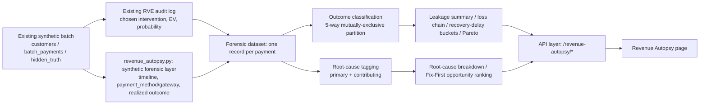

# Revenue Recovery Autopsy — Revenue Loss Forensics

**This is an offline/synthetic analysis of a synthetic dataset and does not establish production causal relationships.** Read that sentence before quoting any number below — see [Section 15, Honesty boundary](#15-honesty-boundary).

## 1. Problem

The rest of this repo (the Recovery Value Engine, "RVE") answers *"what should we do with this one already-failed payment right now?"* — probability model → EV → optimizer → guardrails → chosen intervention. That's the right question for *executing* a recovery decision, but it never asks *why* the payment failed in the first place, whether that failure was avoidable, or what a merchant should change so an entire class of failures happens less often.

Revenue Recovery Autopsy answers that second question: **why did this revenue leak, how much of it was preventable or is still recoverable, and what should the merchant fix first?**

## 2. Product thesis

RVE's loop is `failed payment → recovery decision → best action → recover`. Autopsy's loop sits above it:

```
FAILURE → RECONSTRUCT LOSS CHAIN → IDENTIFY ROOT CAUSE → QUANTIFY LEAKAGE
        → SEPARATE PREVENTABLE VS NON-PREVENTABLE → IDENTIFY HIGHEST-VALUE FIX
        → FEED LEARNING BACK INTO REVENUE STRATEGY
```

It is **not** another recovery agent (it never contacts anyone or executes anything) and it is **not** a duplicate of Payment Success Score. PSS asks "how likely is a payment to succeed under current conditions, before it's attempted?" Autopsy asks "why did this already-failed payment's revenue leak, and what should the merchant fix?" — a forensic, after-the-fact question, not a pre-attempt prediction.

## 3. Architecture



`backend/app/revenue_autopsy.py` is a **read-only analysis layer**, same architectural boundary as `evaluator.py` and `recovery_lab.py`: it reads `state.batch_payments`, `state.customers`, `state.hidden_truth`, `state.audit_log`, `state.suppression_list`, and `state.seed`; it never calls Razorpay, never appends to the audit log, and never re-scores the probability model. Every probability/EV number it shows is read straight out of the `AuditRecord` already produced by `/decide` — it does not touch `state.model` at all.

| Reused from | For |
|---|---|
| `app.guardrails.apply_guardrails` | Re-checking whether a not-yet-recovered payment still has an eligible recovery path (RECOVERABLE vs PERMANENTLY_LOST) |
| `app.pss_simulator.PAYMENT_METHODS` | The `payment_method` distribution's vocabulary, kept consistent with PSS's own method list |
| The existing `AuditRecord.all_evs` | Every probability/EV/eligibility number shown — never recalculated |

## 4. Data model

### New fields, and why they exist

Nothing in RVE previously recorded whether a payment **actually** recovered — the audit log only stores the decision (probability, EV, chosen intervention) at decision time. Classifying revenue into natural/intervention/recoverable/permanently-lost/unresolved structurally requires a realized outcome, so this module adds one:

- **Realized recovery outcome** (`recovered: bool`) — a single seeded Bernoulli draw per payment from `clip((base_recovery_prob + uplift_by_intervention[chosen_intervention]) × delay_decay + noise, 0, 1)`. This is the **same formula** `simulator.generate_training_logs` already uses to sample `observed_outcome` — not a new methodology, applied once more for offline post-hoc labeling instead of training-data generation. `delay_decay = clip(1 - 0.02 × decision_delay_hours, 0.35, 1.0)` is a new, documented "recovery-timeliness decay" assumption (same family as `simulator.py`'s own retry-count "customer fatigue" factor) — without it, the recovery-delay-bucket analysis (Section 9) would have no generative relationship to delay at all, and would be reporting sampling noise dressed up as a finding.
- **Forensic lifecycle timestamps**: `checkout_started_at`, `payment_attempted_at` (small offsets *before* the existing `failed_at`), `recovery_decision_at`, `recovery_executed_at`, `recovered_at` (offsets *after* `failed_at`, present only if recovered). Deterministic, seeded off `state.seed`, generated by iterating `batch_payments` sorted by `payment_id` against one RNG stream (the same idiom `simulator.py` itself uses). Ordering is enforced by construction: `checkout_started_at ≤ payment_attempted_at ≤ failed_at ≤ recovery_decision_at ≤ recovery_executed_at ≤ recovered_at`. These are deliberately independent of the **real** wall-clock `AuditRecord.decided_at`, which is untouched and keeps meaning "when this API call actually ran."
- **`payment_method`** and **`gateway`** — not present anywhere else in this codebase. Added because the loss chain's METHOD/GATEWAY stages and the `PAYMENT_INFRASTRUCTURE` taxonomy branch structurally need them, not to make the UI look richer. Hand-picked, documented distributions (`OPPORTUNITY_BUCKETS`' neighboring constants in `revenue_autopsy.py`), sampled **independently** of `failure_reason` — no fabricated causal link between method/gateway and why a payment failed.

All of the above are generated only inside `revenue_autopsy.py`, never written back into `training_logs`, `batch_payments`, or exposed to the probability model.

## 5. Root-cause taxonomy

Six **primary-cause** buckets (a direct, 1:1, documented relabeling of the existing `failure_reason` field — not an inference):

| `failure_reason` | Category | Label |
|---|---|---|
| `bank_timeout` | `payment_infrastructure` | Bank / issuer timeout |
| `network_error` | `payment_infrastructure` | Gateway network error |
| `fraud_block` | `payment_infrastructure` | Issuer fraud block |
| `insufficient_funds` | `customer` | Insufficient funds |
| `card_expired` | `customer` | Expired card |
| `other` | `unknown_multi_factor` | Unclassified / multi-factor |

Four **contributing-cause** tags, each a deterministic rule over existing or newly-added signals, always labeled **"Attributed cause (simulated root-cause attribution)"**, never presented as proven:

| Key | Category | Rule |
|---|---|---|
| `recovery_delay` | `recovery` | Recovery decision made more than 2h after failure |
| `repeated_retries` | `recovery` | `retry_count_so_far ≥ 2` |
| `guardrail_blocking` | `policy` | A blocked alternative in `all_evs` had a strictly higher expected value than the chosen intervention |
| `checkout_latency` | `checkout` | Synthetic checkout-to-attempt gap exceeds 8s |

**Why `CHECKOUT` never gets a standalone revenue figure**: this dataset's unit of analysis is already-attempted failed payments — there is no abandoned-checkout population here. `checkout_latency` stays as a contributing-cause tag on individual payments, but Autopsy deliberately does not fabricate a "checkout abandonment ₹X" headline the data can't support.

Every analyzed payment has **exactly one** primary cause and zero-or-more contributing causes. If ambiguous, `failure_reason = "other"` maps cleanly to `UNKNOWN_MULTI_FACTOR` rather than forcing a specific category.

## 6. Outcome classification

A strict 5-way partition, computed as a single `if/elif` chain per payment (never independent booleans), so double-counting is structurally impossible:

- **`NATURAL_RECOVERY`** — `chosen_intervention == "no_action"` and recovered.
- **`INTERVENTION_RECOVERY`** — any other intervention and recovered (worded "recovered while intervention X was active" — an observational label, not a causal claim that the intervention caused it).
- **`RECOVERABLE`** — not recovered, within the 7-day recovery window, and re-running `apply_guardrails` with the real cumulative contact count from the audit log leaves at least one action beyond `no_action` eligible.
- **`PERMANENTLY_LOST`** — not recovered, and either the window expired or guardrails leave nothing eligible.
- **`UNRESOLVED`** — no audit record found for this payment (defensive; exercised in tests by deliberately dropping a record, the same technique `test_failure_scenarios.py` already uses for a missing-customer edge case).

## 7. Preventability methodology

`preventable_amount = payment.amount × preventability_factor[primary_cause]`, where `preventability_factor` is a small, documented, hand-picked table (e.g. expired-card 0.70, reflecting this project's own "a channel problem, not an intent problem" framing; fraud-block 0.05, consistent with `simulator.py`'s own near-zero fraud uplift). Always worded **"potentially preventable"** or **"preventable under simulated conditions"** — never "definitely preventable." Preventability is a property of the failure *class*, computed for every payment regardless of its recovery outcome (a payment that happened to recover organically can still belong to a class the model treats as "preventable" — this is about the class, not the individual outcome).

## 8. Fix-First opportunity score

Presented as two transparent steps, not one opaque formula:

1. `preventable_revenue_for_bucket = bucket_revenue × preventability_factor`
2. `opportunity_score = preventable_revenue_for_bucket × feasibility ÷ estimated_fix_cost`

`feasibility` (0–1) and `estimated_fix_cost` (₹) are a small, explicitly **illustrative** reference table per opportunity bucket (e.g. Recovery delay: feasibility 0.9, cost ₹50,000 — a cheap ops/SLA fix; Bank timeout: feasibility 0.4, cost ₹500,000 — a large infrastructure investment) — hand-picked to demonstrate the ranking methodology, **not derived from any real implementation-cost data**. `expected_value_of_fix = preventable_revenue_for_bucket × feasibility` is reported separately from the cost-adjusted ranking score.

**Opportunity buckets are not mutually exclusive.** A payment has exactly one primary cause but can carry several contributing-cause tags, so bucket revenue figures overlap by design (a rupee can appear in both "Bank timeout" and "Recovery delay" for the same payment) — this is normal for a *prioritization* ranking, but bucket amounts must never be summed and read as a partition of total revenue. The mutually-exclusive partition is the outcome classification in Section 6, not this ranking.

Sorting is deterministic: `(-opportunity_score, cause_key)`, so exact ties resolve the same way every time.

## 9. Recovery delay analysis

Two scalar means (`mean_time_to_first_intervention_hours`, `mean_time_to_recovery_hours`) plus 5 buckets (`<1h`, `1-4h`, `4-12h`, `12-24h`, `>24h`) each reporting a recovery rate. Because the realized outcome's generative formula includes the documented `delay_decay` factor (Section 4), the resulting decline is a genuine — if synthetic — regularity, not noise dressed up as a finding. It is still reported as **"Association observed in simulation, not a proven causal relationship"** and explicitly does **not** claim "delay causes recovery failure" — that phrasing discipline is deliberate even though this particular synthetic generator does encode a real mechanism, because the point of the wording is what an analyst without access to the generator's internals is entitled to conclude from the output alone.

## 10. Pareto concentration

Computed **only** over the mutually-exclusive primary-cause partition (never the overlapping contributing-cause buckets, which would make a concentration claim double-count). `top_n = max(1, round(0.2 × n_categories))`; concentration is reported as detected only if the top `n` categories' revenue share clears 50% — otherwise the API returns "No dominant concentration detected," not a forced narrative.

## 11. API

- `GET /revenue-autopsy/summary` — leakage summary (with explicit `definitions`), loss chain, recovery-delay analysis, Pareto result.
- `GET /revenue-autopsy/causes` — root-cause breakdown (all 10 buckets, sorted by amount) and the Fix-First ranking (sorted by opportunity score) with `top_recommendation` and the exact `formula_note`.
- `GET /revenue-autopsy/payments?page=&page_size=&cause=&status=&search=` — server-side paginated and filtered payment-level forensic ledger; the full batch is never shipped to the browser.

All response bodies are Pydantic models in `backend/app/models.py` (`RevenueAutopsy*`, `ForensicPaymentRecord`, `RootCauseDetail`, `FixFirstOpportunity`, …) — no raw dicts cross the API boundary.

**A field-level note found during the forensic-integrity audit (Section 41, `#11`):** `RootCauseDetail.percentage_of_total` in `/revenue-autopsy/causes` is each cause's own share of total revenue at risk, not a partition across the full `causes` list. Summed over the 6 `kind="primary"` rows alone it totals ~100% (verified); summed over all 10 rows (primary + contributing) it overshoots 100%, because contributing-cause rows deliberately overlap primary causes and each other (Section 8). The current UI (`RootCauseBreakdown.tsx`) does not render this field as a column, so there is no live UI-facing artifact today — this is documented so a future consumer of the raw API doesn't mistake it for one.

## 12. UI

`/revenue-autopsy`, a top-level sibling route (same pattern as `/recovery-lab` and `/payments`), reusing the existing `Layout` sidebar (one new nav item, no second sidebar) and the existing design-system primitives (`Card`, `StatusBadge`, the `Th`/`Td` table idiom, and the `<details>` expand idiom already used elsewhere in this app instead of introducing a new drawer/modal component). The narrative order matches the task's structure: header → leakage summary → loss chain → root-cause breakdown → recovery-delay analysis → Pareto → opportunity quadrant → Fix-First → payment-level forensic table → methodology.

**PSS integration is satisfied via deep-linking, not duplication.** Rather than re-deriving PSS's per-payment synthetic conditions inside the forensic engine (a second synthetic-conditions system plus N extra `/pss/score` calls for a comparison exhibit), every forensic row and the existing `/payments/:paymentId` page — which already shows PSS-before vs. RVE-outcome-after in one continuous view — is one click away. This follows the project's own instruction not to build a second payment-detail system.

**No LLM anywhere in this feature.** Every sentence (Fix-First's "why," the Pareto statement, the delay disclaimer) is built from computed values via string templates, matching the rest of this project's "the only LLM call is RVE's own explanation step" claim.

## 13. Limitations

- **The Fix-First ranking is sensitive to the hand-picked `feasibility`/`fix_cost` table, not only to the underlying data.** In practice, "Recovery delay" tends to rank first in most batches largely *because* it was assigned a low illustrative cost (₹50,000) and high feasibility (0.9), not solely because the data shows it to be the most severe issue. A different, equally plausible cost table could reorder the ranking without any change to the underlying payment data. This is disclosed here deliberately — a ranking this sensitive to its own assumptions should not be read as an objective severity ordering, only as a demonstration of the methodology.
- Resource allocation and priority ranking use hand-picked, illustrative `feasibility`/`fix_cost` figures — not real implementation-cost data, because none exists for a synthetic project.
- Zero-occurrence opportunity buckets (a contributing-cause tag nothing triggered in the current batch, or a primary cause that happened not to occur) are excluded from the Fix-First ranking — a ₹0 opportunity is not a priority — but primary causes still appear in the root-cause breakdown table at zero so the taxonomy stays visibly complete.
- `payment_method` and `gateway` are sampled independently of `failure_reason` — a deliberate simplification; no causal link between method/gateway choice and why a payment failed is implied.
- `CHECKOUT` never carries a standalone revenue figure (Section 5) — this dataset has no abandoned-checkout population to attribute it to.
- The contact-frequency/guardrail re-check for `RECOVERABLE` vs `PERMANENTLY_LOST` uses the *current* cumulative contact count from the real audit log, but the synthetic recovery timeline (decision/execution/recovered timestamps) is independent of that log's real timestamps — the two are deliberately not reconciled minute-by-minute, only ordering-consistent.
- Mock mode (`mocks/revenueAutopsyFixtures.ts`) omits the `repeated_retries` contributing-cause tag because the existing mock `Decision` fixture doesn't expose `retry_count_so_far` — a documented simplification, not a silent gap.

## 14. Correlation vs. causation boundary

Every "contributing cause," delay-bucket pattern, and preventability figure in this feature is an **attribution under a documented deterministic rule**, not a proven causal finding. The UI never states that a contributing cause *caused* the loss, that delay *causes* recovery failure, or that a preventable amount is *guaranteed* recoverable — the wording is deliberately hedged ("attributed," "potentially preventable," "association observed in simulation") throughout the API and the UI copy, not only in this document.

## 15. Honesty boundary

- **Offline and synthetic, end to end.** Every number comes from the existing synthetic simulator, the existing trained RVE model's already-computed decisions, and this module's own documented synthetic layer — never real transactions, real customers, or live gateway/bank telemetry.
- **Never presented as production analytics, real customer behavior, live gateway diagnosis, production root-cause detection, or actual bank diagnosis.** The page carries a persistent "Offline analysis" badge and an explicit "Analysis is based on synthetic/test payment and recovery data" line above the fold.
- **Never calls Razorpay, sends a real message, or mutates real payment/audit state.** Confirmed by `test_revenue_autopsy_never_appends_to_audit_log`; `revenue_autopsy.py` contains no import of `razorpay_client` at all.
- **Preventable revenue is never claimed as guaranteed** — always "potentially preventable" or "under simulated conditions."
- **Root-cause certainty is bounded to what the taxonomy actually supports** — primary causes are a relabeling of ground-truth data already in the system, not an inference; contributing causes are explicitly labeled attributed/simulated, never proven.
